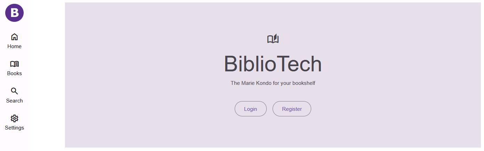
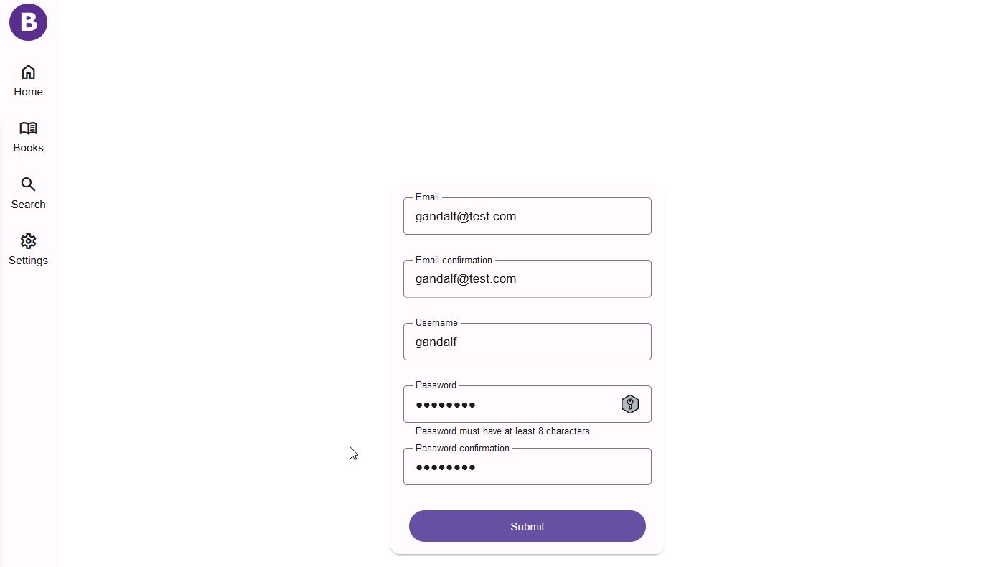
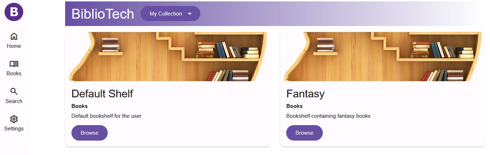
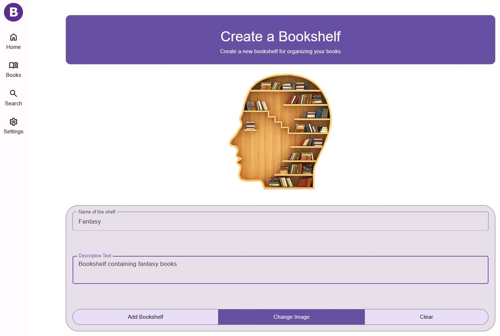
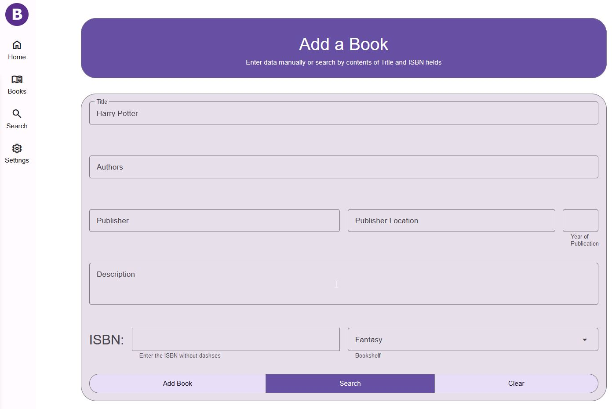
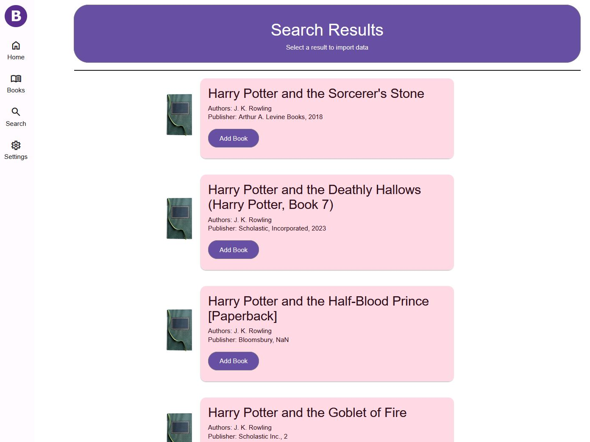
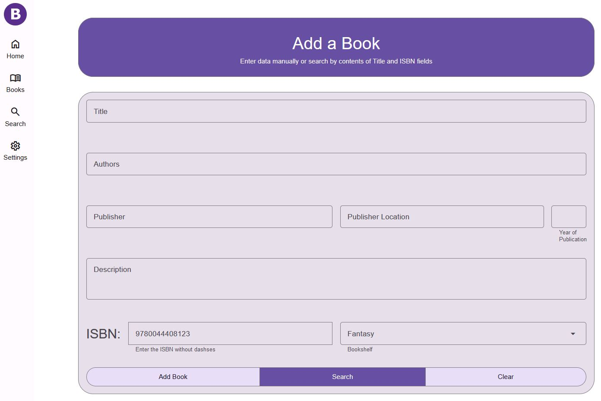
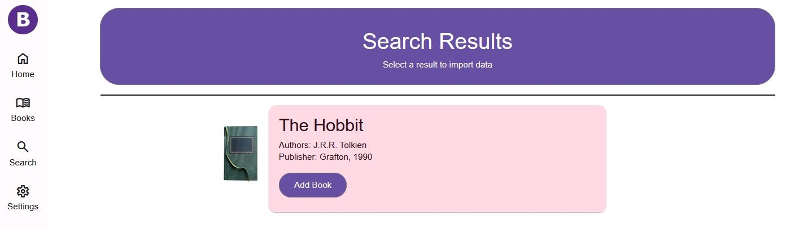

# Agile Software Projects (year 2)
### Final project for Agile Software Projects: BiblioTech
#### Bookshelf organizer web application
&nbsp; 
&nbsp; 
&nbsp; 
&nbsp; 

### Video of project: 
#### [link](https://drive.google.com/file/d/1v-QSIr7rlFA2QT6xqDEBTX2Imd2nLdLW/view?usp=drive_link)
&nbsp; 
&nbsp; 
&nbsp; 
&nbsp; 

### Screenshots of pages
&nbsp; 
&nbsp;
#### Index

&nbsp; 
&nbsp; 

#### Register

&nbsp; 
&nbsp; 

#### Bookshelf

&nbsp; 
&nbsp; 

#### Create bookshelf 

&nbsp; 
&nbsp; 

#### Book search book by name, author, etc.

&nbsp; 
&nbsp; 

#### Book search book by ISBN

&nbsp; 
&nbsp; 

