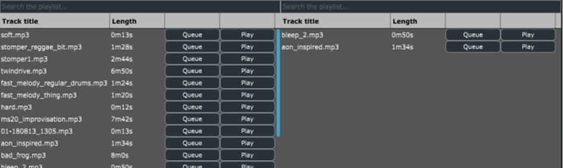
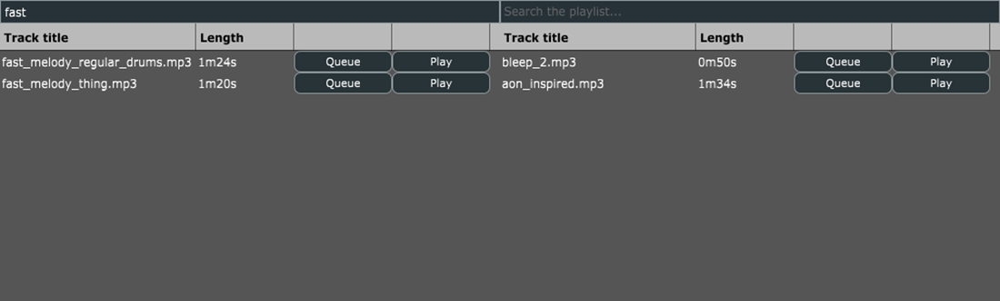

# Object Oriented Programming (year 2)
### Final project for Object Oriented Programming: DJ Application
#### DJ application created with C++ in Visual Studio
&nbsp; 
&nbsp; 
&nbsp; 
&nbsp; 

### Video of project: 
#### [link](https://drive.google.com/file/d/1CWjQwo03bJumDBAD7qlawFgsEuJS3086/view?usp=drive_link)
&nbsp; 
&nbsp; 
&nbsp; 
&nbsp; 

### Screenshots of the application
&nbsp; 
&nbsp;
#### Application on load

&nbsp; 
&nbsp; 

#### Application in use

&nbsp; 
&nbsp; 

#### Playlist components

&nbsp; 
&nbsp; 

#### Playlist search functionality

&nbsp; 
&nbsp; 
